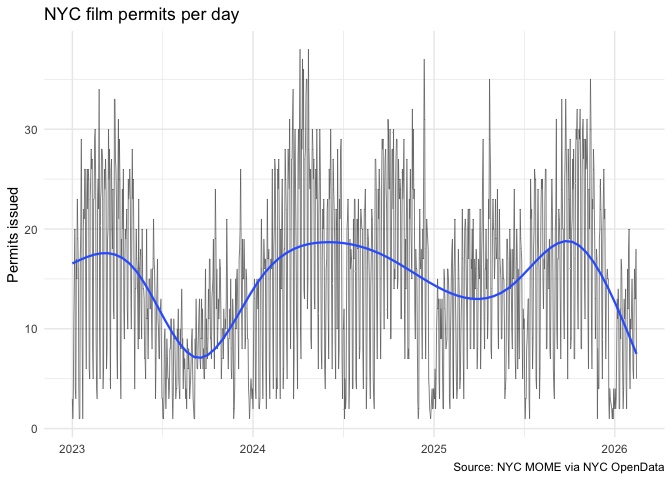
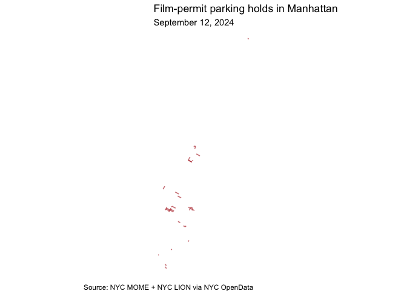

<!-- README.md is generated from README.Rmd. Please edit that file -->

# nycsets 

<!-- badges: start -->

[](https://github.com/kjhealy/nycsets/actions/workflows/R-CMD-check.yaml)
<!-- badges: end -->

`nycsets` packages film, television, and other production permits issued
by the New York City Mayor’s Office of Media and Entertainment (MOME).
It provides one main permits table and three long companion tables that
link each permit to its affected community boards, NYPD precincts, and
ZIP codes.

## Installation

You can install the development version of nycsets from GitHub with:

``` r
# install.packages("remotes")
remotes::install_github("kjhealy/nycsets")
```

## Load

``` r
library(tidyverse)
library(nycsets)
```

## What’s included

``` r
nyc_film_permits_df
#> # A tibble: 17,177 × 13
#>    event_id event_type      start_date_time     end_date_time      
#>       <int> <chr>           <dttm>              <dttm>             
#>  1   677665 Shooting Permit 2023-02-08 06:00:00 2023-02-08 22:00:00
#>  2   677666 Shooting Permit 2023-02-09 06:00:00 2023-02-09 22:00:00
#>  3   677670 Shooting Permit 2023-02-10 06:00:00 2023-02-10 22:00:00
#>  4   677675 Shooting Permit 2023-02-11 06:00:00 2023-02-11 22:00:00
#>  5   677679 Shooting Permit 2023-02-12 06:00:00 2023-02-12 22:00:00
#>  6   677681 Shooting Permit 2023-02-13 06:00:00 2023-02-13 22:00:00
#>  7   677682 Shooting Permit 2023-02-14 06:00:00 2023-02-14 22:00:00
#>  8   677683 Shooting Permit 2023-02-15 06:00:00 2023-02-15 22:00:00
#>  9   677684 Shooting Permit 2023-02-16 06:00:00 2023-02-16 22:00:00
#> 10   677685 Shooting Permit 2023-02-17 06:00:00 2023-02-17 22:00:00
#> # ℹ 17,167 more rows
#> # ℹ 9 more variables: entered_on <dttm>, parking_held <chr>, borough <chr>,
#> #   community_boards <chr>, police_precincts <chr>, category <chr>,
#> #   sub_category_name <chr>, country <chr>, zip_codes <chr>

nyc_film_permit_boards_df
#> # A tibble: 21,432 × 2
#>    event_id community_board
#>       <int>           <int>
#>  1   677665               4
#>  2   677666               4
#>  3   677670               4
#>  4   677675               4
#>  5   677679               4
#>  6   677681               4
#>  7   677682               4
#>  8   677683               4
#>  9   677684               4
#> 10   677685               4
#> # ℹ 21,422 more rows

nyc_film_permit_precincts_df
#> # A tibble: 22,030 × 2
#>    event_id police_precinct
#>       <int>           <int>
#>  1   677665              18
#>  2   677666              18
#>  3   677670              18
#>  4   677675              18
#>  5   677679              18
#>  6   677681              18
#>  7   677682              18
#>  8   677683              18
#>  9   677684              18
#> 10   677685              18
#> # ℹ 22,020 more rows

nyc_film_permit_zips_df
#> # A tibble: 26,067 × 2
#>    event_id zip_code
#>       <int> <chr>   
#>  1   677665 10019   
#>  2   677666 10019   
#>  3   677670 10019   
#>  4   677675 10019   
#>  5   677679 10019   
#>  6   677681 10019   
#>  7   677682 10019   
#>  8   677683 10019   
#>  9   677684 10019   
#> 10   677685 10019   
#> # ℹ 26,057 more rows

nyc_film_permit_parking_df
#> # A tibble: 58,172 × 6
#>    event_id segment_seq main_street    from_street to_street matched
#>       <int>       <int> <chr>          <chr>       <chr>     <lgl>  
#>  1   677665           1 WEST 58 STREET 10 AVENUE   11 AVENUE TRUE   
#>  2   677666           1 WEST 58 STREET 10 AVENUE   11 AVENUE TRUE   
#>  3   677670           1 WEST 58 STREET 10 AVENUE   11 AVENUE TRUE   
#>  4   677675           1 WEST 58 STREET 10 AVENUE   11 AVENUE TRUE   
#>  5   677679           1 WEST 58 STREET 10 AVENUE   11 AVENUE TRUE   
#>  6   677681           1 WEST 58 STREET 10 AVENUE   11 AVENUE TRUE   
#>  7   677682           1 WEST 58 STREET 10 AVENUE   11 AVENUE TRUE   
#>  8   677683           1 WEST 58 STREET 10 AVENUE   11 AVENUE TRUE   
#>  9   677684           1 WEST 58 STREET 10 AVENUE   11 AVENUE TRUE   
#> 10   677685           1 WEST 58 STREET 10 AVENUE   11 AVENUE TRUE   
#> # ℹ 58,162 more rows
```

`nyc_film_permit_parking_sf` is an `sf` MULTILINESTRING collection in
EPSG:2263 with the same key columns plus LION attributes:

``` r
nyc_film_permit_parking_sf |>
  sf::st_drop_geometry() |>
  head(5)
#> # A tibble: 5 × 10
#>   event_id segment_seq main_street    segment_id physical_id lion_street  l_boro
#>      <int>       <int> <chr>          <chr>            <int> <chr>         <int>
#> 1   677665           1 WEST 58 STREET 0346568         198160 WEST 58 STR…      1
#> 2   677665           1 WEST 58 STREET 0346569         198160 WEST 58 STR…      1
#> 3   677665           1 WEST 58 STREET 0346571         198160 WEST 58 STR…      1
#> 4   677665           1 WEST 58 STREET 0346572         198160 WEST 58 STR…      1
#> 5   677666           1 WEST 58 STREET 0346568         198160 WEST 58 STR…      1
#> # ℹ 3 more variables: r_boro <int>, l_zip <chr>, r_zip <chr>
```

## Examples

Top production categories by borough:

``` r
nyc_film_permits_df |>
  filter(!is.na(borough)) |>
  count(borough, category) |>
  pivot_wider(
    names_from = borough,
    values_from = n,
    values_fill = 0
  ) |>
  arrange(desc(Manhattan))
#> # A tibble: 9 × 6
#>   category          Bronx Brooklyn Manhattan Queens `Staten Island`
#>   <chr>             <int>    <int>     <int>  <int>           <int>
#> 1 Television          314     2404      2853   1680              50
#> 2 Theater               5      878      2431      0               0
#> 3 Film                 74      881      1076    302              70
#> 4 Commercial           58      753       968    136               9
#> 5 Still Photography     2      321       715     33               1
#> 6 WEB                  14      309       480     37               6
#> 7 Documentary           2       42        89     11               8
#> 8 Student               6       26        49     18               0
#> 9 Music Video           1       31        29      5               0
```

Permits per day over time:

``` r
nyc_film_permits_df |>
  filter(!is.na(start_date_time)) |>
  mutate(date = as.Date(start_date_time)) |>
  count(date) |>
  ggplot(aes(date, n)) +
  geom_line(linewidth = 0.3, alpha = 0.6) +
  geom_smooth(se = FALSE, linewidth = 0.8) +
  labs(
    x = NULL,
    y = "Permits issued",
    title = "NYC film permits per day",
    caption = "Source: NYC MOME via NYC OpenData"
  ) +
  theme_minimal()
#> `geom_smooth()` using method = 'gam' and formula = 'y ~ s(x, bs = "cs")'
```



A map of the streets held for parking on one busy permit day,
2024-09-12:

``` r
day <- as.Date("2024-09-12")
day_permits <- nyc_film_permits_df |>
  filter(
    as.Date(start_date_time, tz = "America/New_York") == day,
    borough == "Manhattan"
  )
day_geo <- nyc_film_permit_parking_sf |>
  filter(event_id %in% day_permits$event_id)
ggplot(day_geo) +
  geom_sf(colour = "firebrick", linewidth = 0.6, alpha = 0.6) +
  coord_sf(crs = 2263) +
  labs(
    title = "Film-permit parking holds in Manhattan",
    subtitle = format(day, "%B %e, %Y"),
    caption = "Source: NYC MOME + NYC LION via NYC OpenData"
  ) +
  theme_void()
```



Top ten ZIP codes by permit count:

``` r
nyc_film_permit_zips_df |>
  count(zip_code, sort = TRUE) |>
  slice_head(n = 10)
#> # A tibble: 10 × 2
#>    zip_code     n
#>    <chr>    <int>
#>  1 11222     2533
#>  2 11101     1338
#>  3 10036     1111
#>  4 10019     1020
#>  5 10001      975
#>  6 10013      950
#>  7 10023      924
#>  8 10003      877
#>  9 10011      603
#> 10 11201      600
```
